# Automated Discount Governance Workflow in Salesforce
This project focuses on the design and implementation of an automated Discount Approval Workflow in Salesforce to support structured sales governance and operational efficiency.

The solution automates the approval process for discount requests based on predefined business rules and approval thresholds, reducing manual intervention while improving visibility, consistency, and control within the sales process.

# Executive Background
In many sales organizations, discount approvals are often handled manually through emails, chats, or informal managerial reviews. This can lead to delayed approvals, inconsistent pricing decisions, limited visibility into the approval lifecycle, and increased risk of unauthorized discounts.

As sales teams scale, the absence of a structured approval framework can create operational inefficiencies and revenue leakage risks. Organizations require a centralized and automated process that ensures discount requests are reviewed according to predefined approval thresholds and business rules.

This project demonstrates the implementation of an automated discount approval workflow in Salesforce designed to improve governance, streamline approval routing, enhance visibility, and support more consistent pricing control across the sales process.

# Business Objective
The primary objectives of this project were to:

- Automate the discount approval process within Salesforce
- Reduce manual approval dependencies and approval delays
- Enforce standardized discount approval policies
- Improve visibility into the approval lifecycle
- Strengthen pricing governance and control mechanisms
- Ensure high-discount requests are escalated appropriately
- Enhance operational efficiency within the sales process
- Minimize the risk of unauthorized discount approvals 
# Tools & Technologies
| Tool / Technology | Purpose |
|---|---|
| Salesforce Sales Cloud | Core CRM platform used for workflow implementation |
| Flow Builder | Automated approval routing and process automation |
| Approval Processes | Managed multi-level discount approval workflows |
| Validation Rules | Enforced discount policy and input restrictions |
| Profiles & Roles | Controlled approval access and user permissions |
| Email Notifications | Sent automated approval and rejection updates |
| Custom Objects & Fields | Captured discount-related business data |
| Record-Triggered Flows | Automated actions based on opportunity updates |
## Workflow Logic

The workflow was designed to automate discount approval routing based on predefined discount thresholds and organizational approval policies within Salesforce.

When a sales representative submits an opportunity with a discount request, the system automatically evaluates the discount percentage and routes the request to the appropriate approver level.

### Approval Structure

| Discount Range | Approval Level |
|---|---|
| 0% – 14% | Automatically Approved |
| 15% – 40% | Courtney, Sales Manager Approval Required |
| Above 40%  | Allison, VP of Sales Approval Required |

### Workflow Process

1. Sales representative submits an opportunity containing a discount request.
2. Salesforce evaluates the discount percentage using workflow logic and validation conditions.
3. The approval request is automatically routed to the designated approver.
4. Automated notifications are sent to approvers and request owners.
5. Approved requests proceed through the sales process, while rejected requests are returned for review or modification.
6. Approval activities are logged to maintain visibility and audit tracking throughout the process.

# Automation Process Flow

The automation process was designed to streamline discount approval routing, improve approval visibility, and enforce standardized approval controls across the sales workflow.

### Configuration Steps

1. Discount Percentage Field And Object Creation

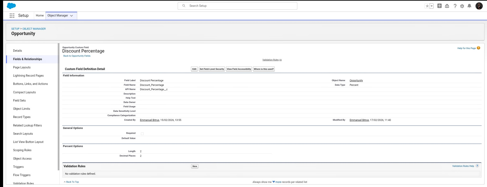
*Created a discount percentage field frpm the opportunity object manager.*

2. Discount Approval Process Creation / Routing

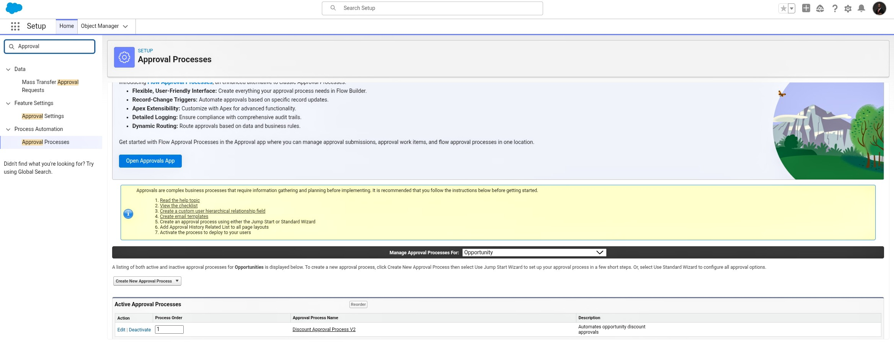
*Created a discount approval process.*

2a.  Discount Approval Process Dynamics (Courtney, Manager)

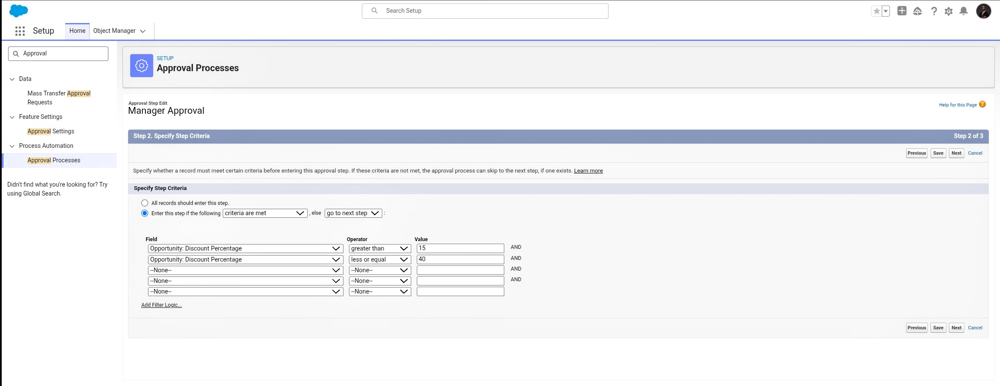
*This Image shows the discount approval threshold rule for Courtney, the Manager.*

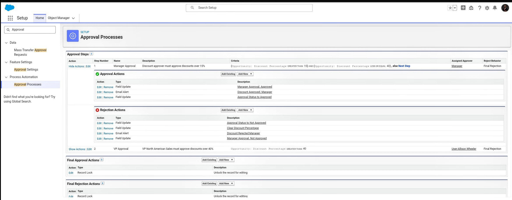
*This Image shows the discount approval routing Rule for Courtney, the Manager.*

2b.  Discount Approval Process Dynamics (Allison, VP of Sales)

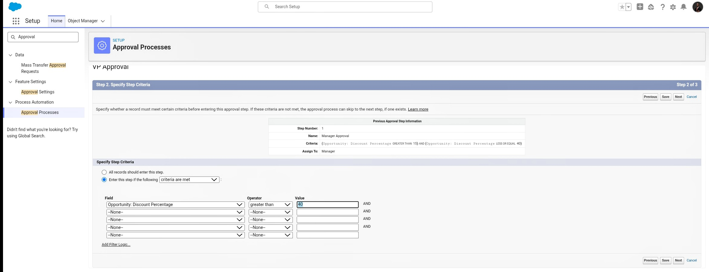
*This Image shows the discount approval threshold rule for Allison, the VP of sales.*

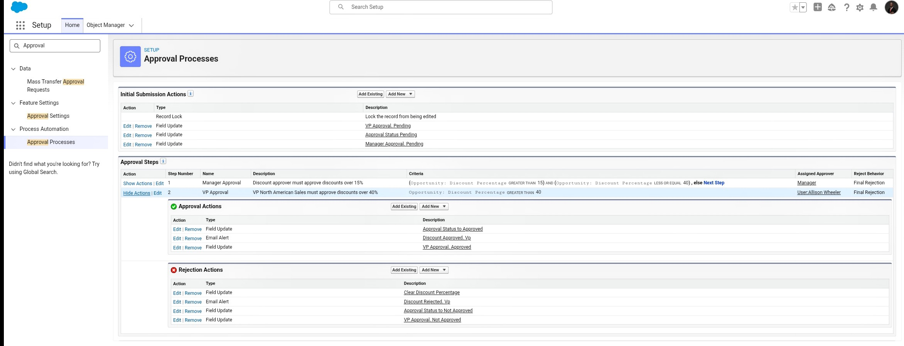
*This Image shows the discount approval routing rule for Allison, the VP of sales.*

### Process Stages

1. Opportunity Creation 

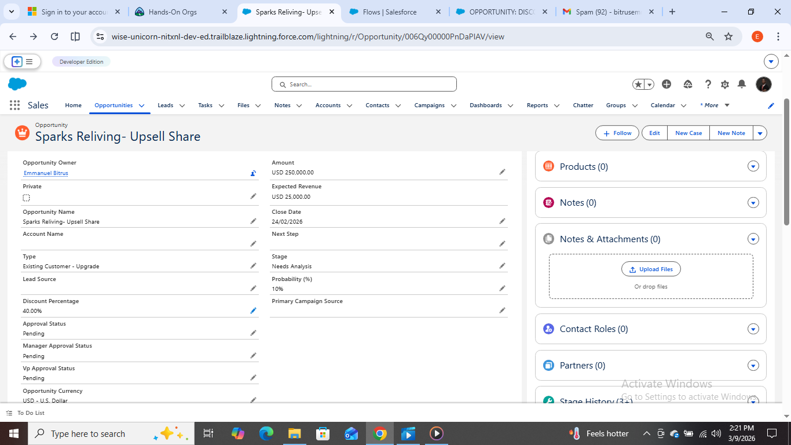
*An Opportunity is created by a sales rep. In this case, with a 40% discount request. This goes to the Manager for approval.*

---
 
2. Approval Threshold Evaluation

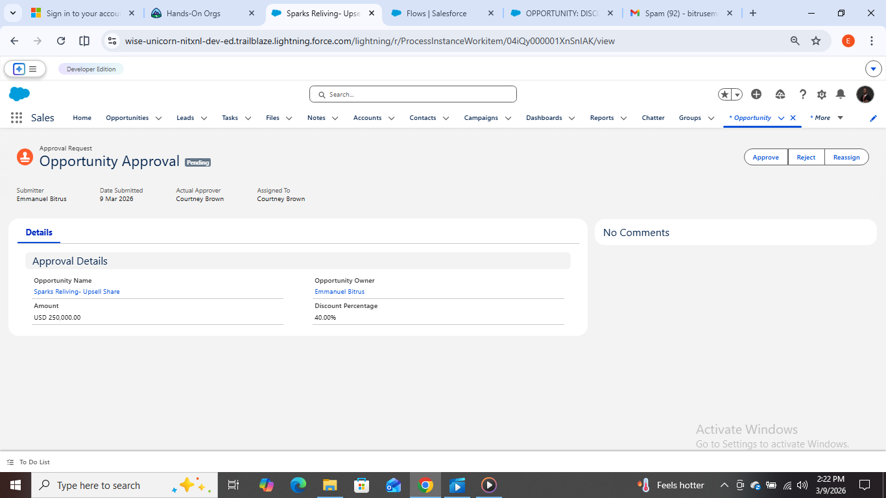
*The opportunity process pauses until there is an approval from the required approval. In this case, the Manager*

---

3. Notification & Status Update

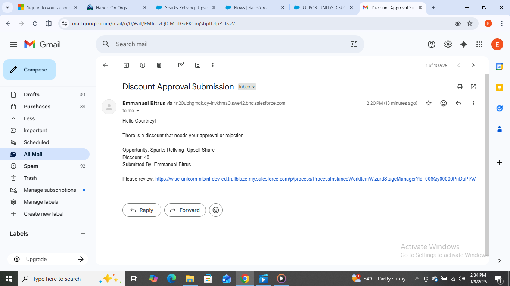
*Immediately the opportunity discount is updated by the rep, an email is sent to the required approver, the manager in this case.*

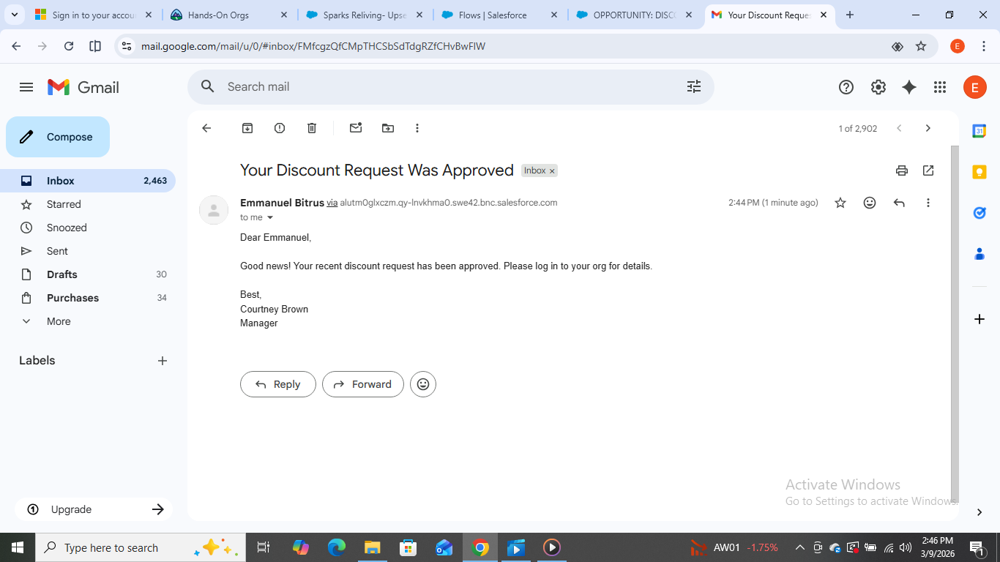
*After the manager has approved the discount request, an email is sent to the sales rep who is the owner of the opportunity.*

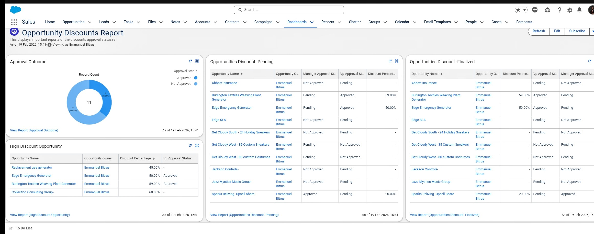
*This Dashboard helps reps, the manager, the VP of Sales, to track the trends of opportunities with discount (each only sees the report they are permitted to see).*

### Workflow Diagram

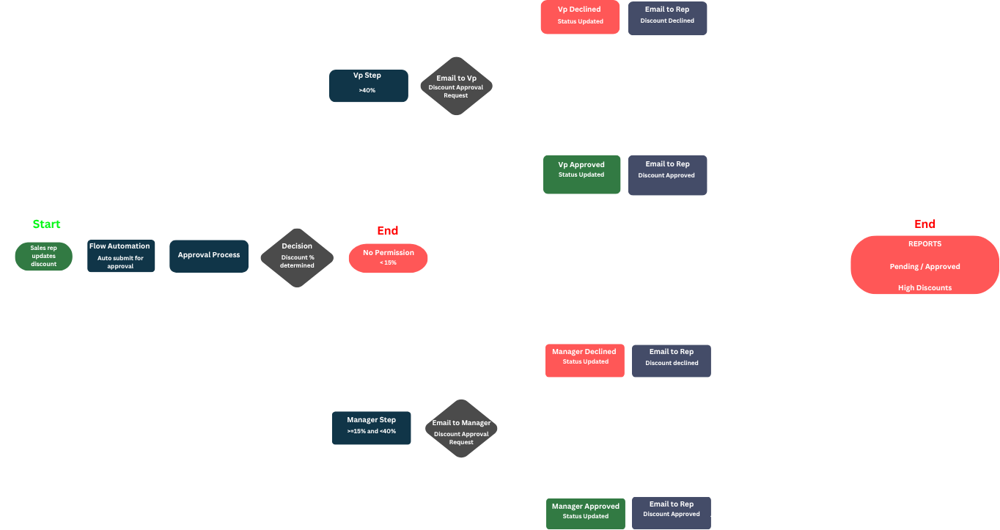

*This image shows the process flow of the discount approval process.*

### Salesforce Flow Builder Preview

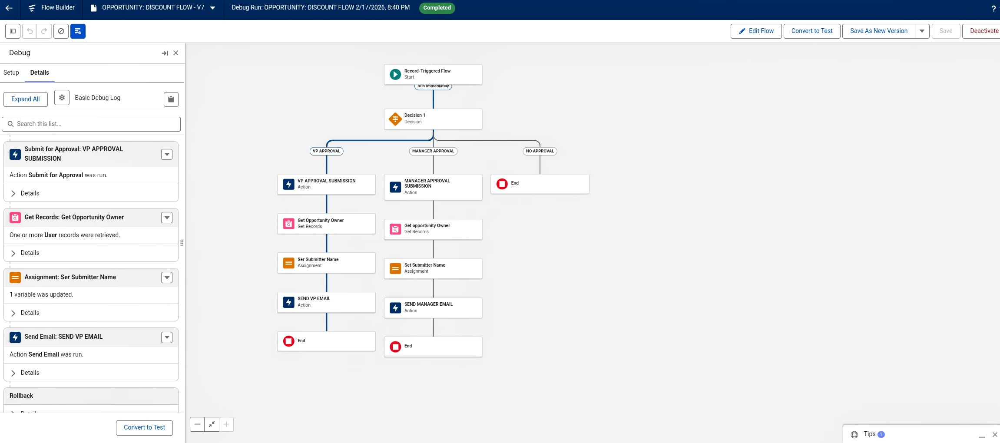
*This image shows the record triggered flow that automatically recoprgnizes discount discounts by reps and routes those beyond threshold to their various approvers i.e >15% and <=40% to the Manager, >40% to the VP of Sales.*

This  flow  dynamically uses merged field in sending emails to request approval from the approver whose discount threshold is breached.  Containing the the name of the rep who made the discount, the name of the opportunity, with a clickable link to help the approver go directly to the opportunity to approve or decline. 

This flow also sends back an email response of the approver to the rep telling them the new status. While automatically updating the discount field of the opportunity.

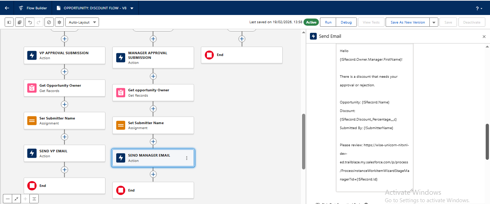
*This image shows the configured mail to be sent to the Manager.*

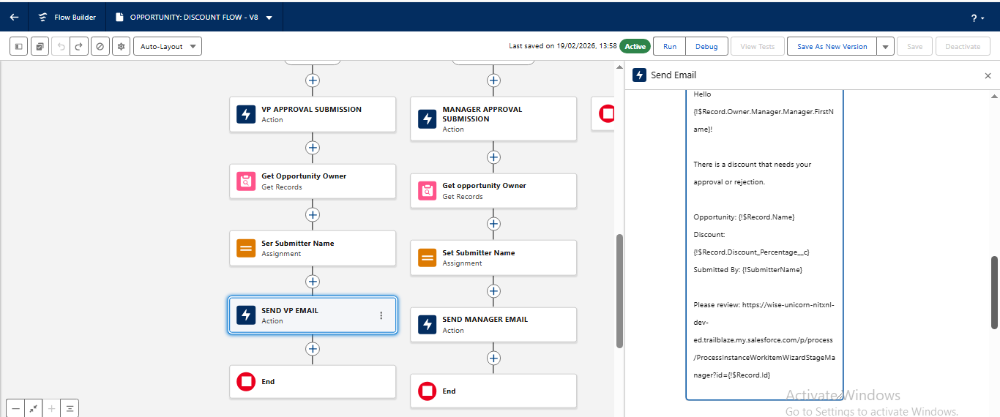
*This image shows the configured mail to be sent to the VP Of Sales.*

## Testing & Validation

The workflow was tested across multiple approval scenarios to ensure accurate routing, validation enforcement, and approval visibility throughout the sales process.

### Test Scenarios Executed

| Test Scenario | Expected Outcome | Result |
|---|---|---|
| Discount within auto-approval threshold | Opportunity approved automatically | Passed |
| Discount requiring manager approval | Approval request routed to Sales Manager | Passed |
| High discount request submission | Escalated to senior approval level | Passed |
| Invalid discount value entry | Validation rule triggered | Passed |
| Approval rejection scenario | Opportunity returned for modification | Passed |
| Approval notification trigger | Email notification sent successfully | Passed |

### Validation Areas

- Approval threshold accuracy
- Routing logic consistency
- Validation rule enforcement
- Notification automation
- Approval status updates
- Rejection and resubmission handling
- User access and permission controls

## Challenges & Solutions

| Challenge | Solution Implemented |
|---|---|
| Manual approval processes created delays in deal progression | Implemented automated approval routing using Salesforce Flow Builder |
| Inconsistent discount approvals across sales teams | Established standardized approval thresholds and workflow rules |
| Limited visibility into approval status and activities | Added approval tracking and automated status updates |
| Risk of unauthorized discount approvals | Applied validation rules and role-based approval permissions |
| High-discount requests required additional oversight | Configured multi-level escalation and approval routing |
| Communication gaps during approval stages | Implemented automated email notification triggers |

## Business Impact

The implementation of the automated discount approval workflow improved operational efficiency, strengthened pricing governance, and reduced dependency on manual approval coordination within the sales process.

### Operational Impact

- Streamlined the discount approval lifecycle through automated routing
- Reduced manual intervention and approval processing delays
- Improved visibility into approval activities and approval status tracking
- Standardized discount approval procedures across sales operations
- Strengthened control over high-discount approval requests
- Enhanced accountability through structured approval monitoring
- Improved consistency in pricing governance and decision-making
- Supported a more scalable and efficient sales operations process

## Future Improvements

Potential future enhancements for the workflow include:

- Integration with Slack or Microsoft Teams for real-time approval notifications
- Dynamic approval thresholds based on deal size or customer segment
- Real-time approval performance dashboards and reporting
- Automated escalation reminders for delayed approvals
- Advanced audit logging and approval analytics
- Mobile approval functionality for faster decision-making
- AI-driven discount recommendation and risk assessment features
- Expanded workflow integration with revenue and forecasting systems